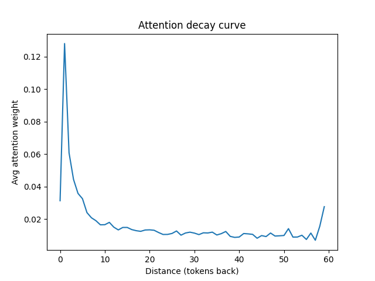
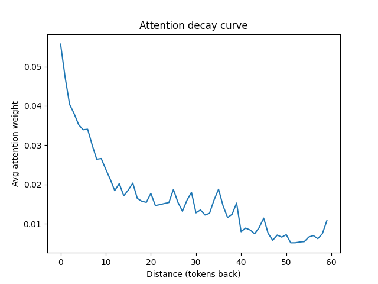
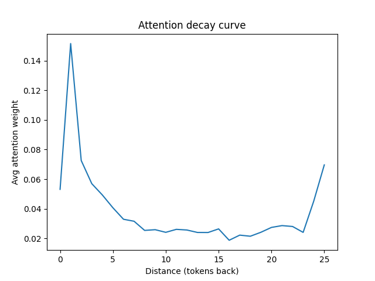
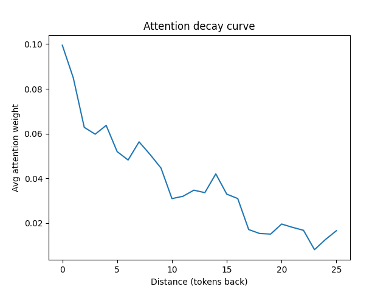
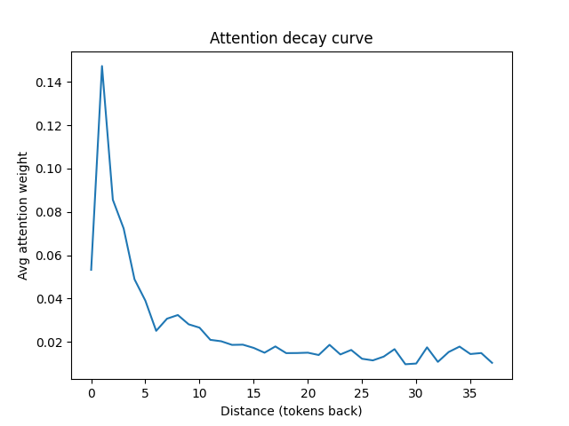
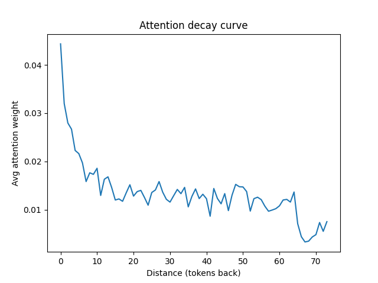
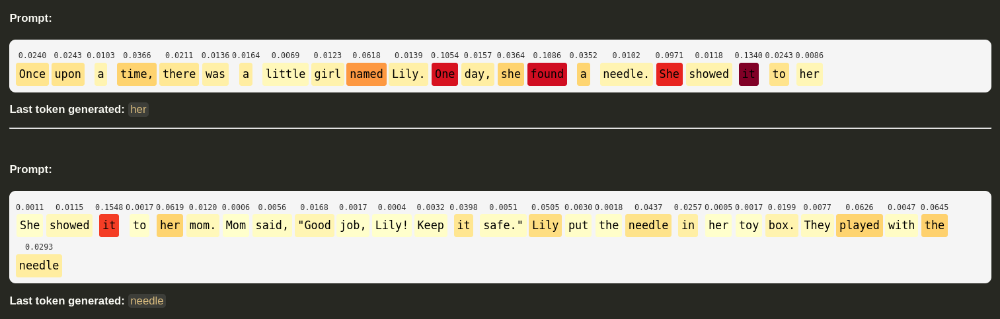
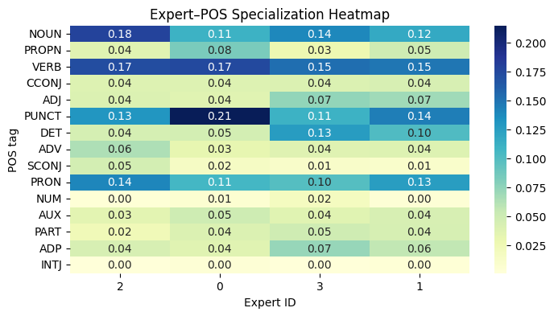

# Training DeepSeek style model on tinystories dataset

## Observations, learnings and analysis

### Trained model
- Model trained for 30k steps with batch size of 24 (total 7,20,000 samples seen) - [sky-2002/deepseek-tinystories-60M](https://huggingface.co/sky-2002/deepseek-tinystories-60M)

### Dataset

[`roneneldan/TinyStories`](https://huggingface.co/datasets/roneneldan/TinyStories)

| Split     |  Size     |
|-----------|-----------|
| train     | 16,95,581 |
| validation| 2,11,958  |
| test      | 2,11,950  |


Stats for the train data:

```
Average tokens: 222.61
95th percentile: 456.0
99th percentile: 646.0
```

Based on this, I have used a context length of 512 tokens, 1% of examples will be truncated.


### Model config used

```python
DeepSeekModelConfig(
    num_attention_heads=8,
    input_dim=512,
    embed_dim=512,
    q_latent_dim=16,
    kv_latent_dim=32,
    max_token_len=512,
    num_shared_experts=2,
    num_routed_experts=4,
    moe_top_k=2,
    expert_intermediate_dim=512*3,
    num_dense_ffn=1,
    num_moe_ffn=2,
    vocab_size=50257,
    max_batch_size= 24,
)
```

The above results in a 58M parameter model.

### Observations from initial training runs

- I noticed that my training gets plateaued after a certain number of iterations. This could be because of small model size, but I did some analysis on my gradient norm and expert usage. I noticed that after a point, only two of my four experts are being used. And grad norm quickly goes towards 0.


- Added the auxiliary loss free load balancing using the bias as mentioned in the [DeepSeek-V3](https://arxiv.org/html/2412.19437v1) technical report. 

| | |
|---|---|
|  | |


### Attention decay curves

| Prompt | Attention decay curve (block 0) | Attention decay curve (block 2 - last block) |
|--------|-----------------------|----------------|
| Once upon a time, there was a little girl named Lily. One day, she found a needle. She showed it to her mom. Mom said, \"Good job, Lily! Keep it safe.\" Lily put the needle in her toy box. They played with the needle all day long" |  |  |
| Once upon a time, there was a little car named Beep. Beep loved to go fast and play in the sun. |  |  |
| Mommy and Emily were playing a matching game together. Emily was so excited to find the matching games at the store. She liked watching the videos on the screen as she matched each card. "Mommy, I think I'm getting really good at this!" Emily said. "That's wonderful, sweetheart!" Mommy replied. "You're doing so well!" |  |  |

The above plots try to answer this question -> `How much attention, on average, does the model pay to tokens that are d steps behind the current one?`

**Interpretation of the plots**

| Stage       | Observed pattern                         | Interpretation                                                                |
| ----------- | ---------------------------------------- | ----------------------------------------------------------------------------- |
| **Block 0** | Peak near 0–3 tokens, falls off < 15     | Local syntactic attention                                                     |
| **Block 2** | Slower decay, non-zero up to 50 + tokens | Broader semantic integration, sentence-level context                          |
| **Change**  | Attention horizon roughly × 3–4 wider    | Later layers combine and compress earlier local info into longer dependencies |


### Attention weights (last layer, averaged across heads) visualization for some prompts



### MoE expert specialization analysis (performed on 200 samples from validation set)



| Expert | Common tokens                          | Possible linguistic role                                                                          |
| ------ | -------------------------------------- | ------------------------------------------------------------------------------------------------- |
| **0**  | `and`, `to`, `named`, `said`, `it`     | **Connector / reporting structure**, handles verbs like *said* and conjunctions.                  |
| **1**  | `big`, `his`, `she`, `he`, `The`       | **Descriptive / referential expert**, more involved in **entity or adjective-like contexts**.     |
| **2**  | `Once`, `time`, `there`, `girl`, `She` | **Narrative setup expert**, handling **story openings and temporal phrases**.                     |
| **3**  | `play`, `with`, `her`, `little`, `in`  | **Action / interaction expert**, stronger in **verb + prepositional patterns** (“play with her”). |

**Interpretation:**
- Expert 0–1 → grammar & attribution (“and”, “said”)
- Expert 2–3 → event & interaction semantics (“play”, “with”, “time”, “She”)
- NOUN peaks in Expert 2 (0.18) → this expert handles object and subject nouns (like “Lily”, “time”, “girl”).
- PUNCT high in Expert 1 → punctuation + quotation boundaries → this expert probably activates for dialogue and sentence ends.